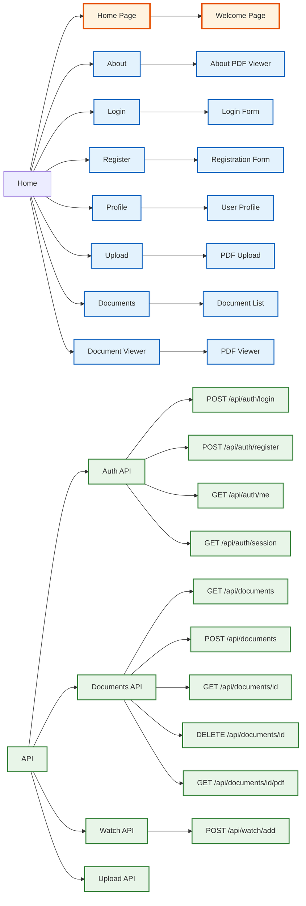
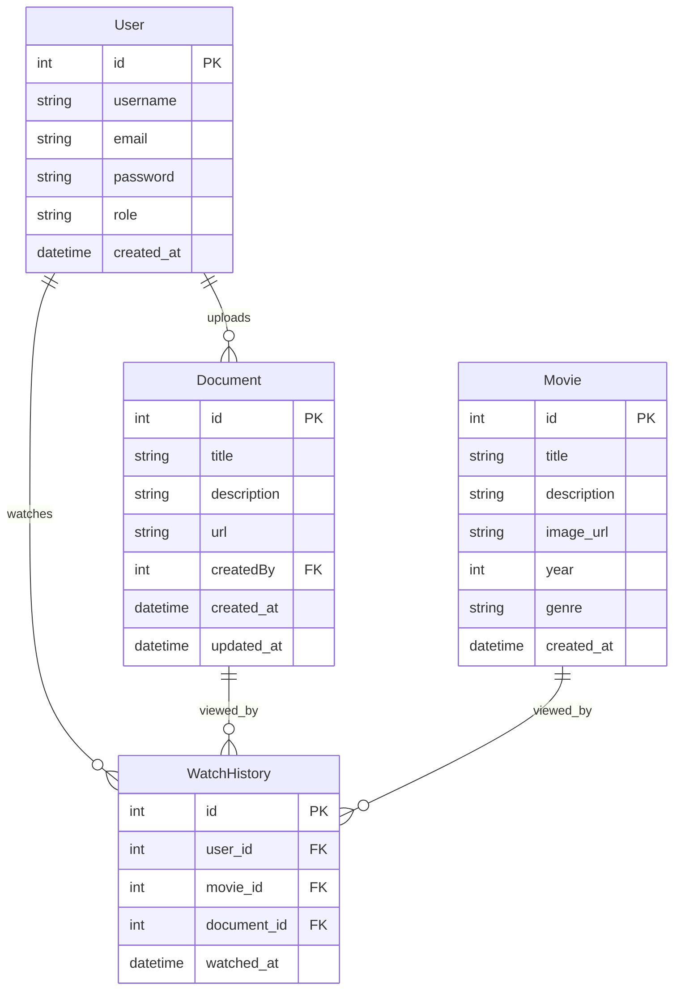

# PDF Viewer Project Structure

## 📁 Project Overview
This is a Next.js PDF viewer application with authentication, file upload, and document management features.

## 🎯 Use Case Diagram

```mermaid
graph TD
    %% Actors
    A[Guest User]
    B[Regular User]
    C[Admin User]
    
    %% Guest User Use Cases
    UC1[View Home Page]
    UC2[View About Page]
    UC3[Register Account]
    UC4[Login to System]
    
    %% Regular User Use Cases
    UC5[View Profile]
    UC6[Browse Documents]
    UC7[Search Documents]
    UC8[View PDF Document]
    UC9[View Document History]
    UC10[Logout]
    
    %% Admin User Use Cases
    UC11[Upload PDF Files]
    UC12[Delete Documents]
    UC13[Manage All Documents]
    UC14[View User Statistics]
    UC15[Access Upload Page]
    
    %% System Functions
    UC16[Authenticate User]
    UC17[Track Document Views]
    UC18[Store Files in S3]
    UC19[Generate PDF Thumbnails]
    UC20[Manage User Sessions]
    
    %% Guest User Relationships
    A --> UC1
    A --> UC2
    A --> UC3
    A --> UC4
    
    %% Regular User Relationships
    B --> UC5
    B --> UC6
    B --> UC7
    B --> UC8
    B --> UC9
    B --> UC10
    
    %% Admin User Relationships
    C --> UC11
    C --> UC12
    C --> UC13
    C --> UC14
    C --> UC15
    C --> UC5
    C --> UC6
    C --> UC7
    C --> UC8
    C --> UC9
    C --> UC10
    
    %% Include Relationships
    UC4 -.-> UC16
    UC8 -.-> UC17
    UC11 -.-> UC18
    UC6 -.-> UC19
    UC4 -.-> UC20
    UC10 -.-> UC20
    
    %% Extend Relationships
    UC7 -.-> UC6
    UC12 -.-> UC13
    UC15 -.-> UC11
    
    %% Styling
    classDef actor fill:#e3f2fd,stroke:#1565c0,stroke-width:3px
    classDef useCase fill:#f3e5f5,stroke:#7b1fa2,stroke-width:2px
    classDef system fill:#e8f5e8,stroke:#2e7d32,stroke-width:2px
    
    class A,B,C actor
    class UC1,UC2,UC3,UC4,UC5,UC6,UC7,UC8,UC9,UC10,UC11,UC12,UC13,UC14,UC15 useCase
    class UC16,UC17,UC18,UC19,UC20 system
```

## 🏗️ File Structure Diagram

```mermaid
graph TD
    A[imdb-next] --> B[src]
    A --> C[prisma]
    A --> D[public]
    A --> E[package.json]
    A --> F[tailwind.config.js]
    A --> G[next.config.mjs]
    
    B --> H[app]
    B --> I[components]
    B --> J[contexts]
    B --> K[lib]
    
    H --> L[layout.jsx]
    H --> M[page.js]
    H --> N[globals.css]
    H --> O[loading.jsx]
    H --> P[error.jsx]
    H --> Q[Providers.jsx]
    
    H --> R[api]
    H --> S[about]
    H --> T[login]
    H --> U[register]
    H --> V[profile]
    H --> W[upload]
    H --> X[documents]
    H --> Y[document]
    
    R --> Z[auth]
    R --> AA[documents]
    R --> BB[watch]
    R --> CC[upload-pdf]
    
    Z --> DD[login/route.js]
    Z --> EE[register/route.js]
    Z --> FF[me/route.js]
    Z --> GG[session/route.js]
    
    AA --> HH[route.js]
    AA --> II[id]
    II --> JJ[route.js]
    II --> KK[pdf]
    KK --> LL[route.js]
    
    BB --> MM[add]
    MM --> NN[route.js]
    
    S --> OO[page.jsx]
    T --> PP[page.jsx]
    U --> QQ[page.jsx]
    V --> RR[page.jsx]
    W --> SS[page.jsx]
    X --> TT[page.jsx]
    Y --> UU[id]
    UU --> VV[page.jsx]
    
    I --> WW[Header.jsx]
    I --> XX[ConditionalLayout.jsx]
    I --> YY[DarkModeSwitch.jsx]
    I --> ZZ[Navbar.jsx]
    I --> AAA[NavbarItem.jsx]
    I --> BBB[MenuItem.jsx]
    
    J --> CCC[AuthContext.js]
    
    K --> DDD[db.js]
    K --> EEE[auth.js]
    
    C --> FFF[schema.prisma]
    C --> GGG[migrations]
    
    D --> HHH[next.svg]
    D --> III[vercel.svg]
    D --> JJJ[spinner.svg]
    D --> KKK[globe.svg]
    D --> LLL[file.svg]
    D --> MMM[window.svg]
    
    %% Styling
    classDef folder fill:#e1f5fe,stroke:#01579b,stroke-width:2px
    classDef file fill:#f3e5f5,stroke:#4a148c,stroke-width:1px
    classDef api fill:#e8f5e8,stroke:#2e7d32,stroke-width:2px
    classDef page fill:#fff3e0,stroke:#e65100,stroke-width:2px
    classDef component fill:#fce4ec,stroke:#880e4f,stroke-width:2px
    
    class A,B,C,D,H,I,J,K,R,S,T,U,V,W,X,Y,Z,AA,BB,CC,II,KK,MM folder
    class E,F,G,L,M,N,O,P,Q,DD,EE,FF,GG,HH,JJ,LL,NN,OO,PP,QQ,RR,SS,TT,VV,WW,XX,YY,ZZ,AAA,BBB,CCC,DDD,EEE,FFF,GGG,HHH,III,JJJ,KKK,LLL,MMM file
    class DD,EE,FF,GG,HH,JJ,LL,NN api
    class OO,PP,QQ,RR,SS,TT,VV page
    class WW,XX,YY,ZZ,AAA,BBB component
```

## 🛣️ Routing Structure

## 🗄️ Database Schema

## 🔧 Key Features

### 📱 **Frontend Pages**
- **Home** (`/`) - Welcome page with features overview
- **About** (`/about`) - Information about the PDF viewer system
- **Login** (`/login`) - User authentication
- **Register** (`/register`) - User registration
- **Profile** (`/profile`) - User profile and statistics
- **Upload** (`/upload`) - PDF file upload (Admin only)
- **Documents** (`/documents`) - List all PDF documents
- **Document Viewer** (`/document/[id]`) - View individual PDF

### 🔌 **API Endpoints**
- **Authentication**: Login, Register, Get current user
- **Documents**: CRUD operations for PDF documents
- **Watch History**: Track document views
- **File Upload**: Proxy to S3 upload server

### 🎨 **Components**
- **Header** - Navigation and dark mode toggle
- **ConditionalLayout** - Conditional rendering based on auth
- **DarkModeSwitch** - Theme toggle functionality
- **Navbar** - Navigation menu items

### 🗄️ **Database**
- **User** - User accounts with roles (ADMIN/USER)
- **Document** - PDF metadata and S3 URLs
- **WatchHistory** - Track user document views
- **Movie** - Legacy movie data (for compatibility)

## 🚀 **Technologies Used**
- **Frontend**: Next.js 15, React, Tailwind CSS
- **Backend**: Next.js API Routes, Prisma ORM
- **Database**: PostgreSQL
- **File Storage**: AWS S3
- **Authentication**: Custom JWT-like tokens
- **PDF Viewing**: Google Docs Viewer, iframe embedding

## 📊 **User Roles**
- **ADMIN**: Can upload, delete PDFs, access all features
- **USER**: Can view PDFs, track viewing history

## 🎯 **Use Case Details**

### 👤 **Guest User (Зочин)**
- **View Home Page** - Үндсэн хуудас харах
- **View About Page** - Тухай хуудас харах
- **Register Account** - Бүртгэл үүсгэх
- **Login to System** - Системд нэвтрэх

### 👤 **Regular User (Энгийн хэрэглэгч)**
- **View Profile** - Профайл харах
- **Browse Documents** - Баримтуудыг харах
- **Search Documents** - Баримтуудыг хайх
- **View PDF Document** - PDF баримт харах
- **View Document History** - Үзсэн баримтуудын түүх
- **Logout** - Гарах

### 👤 **Admin User (Админ)**
- **Upload PDF Files** - PDF файл оруулах
- **Delete Documents** - Баримтуудыг устгах
- **Manage All Documents** - Бүх баримтуудыг удирдах
- **View User Statistics** - Хэрэглэгчийн статистик харах
- **Access Upload Page** - Оруулах хуудас руу хандах

### ⚙️ **System Functions (Системийн функцүүд)**
- **Authenticate User** - Хэрэглэгчийг баталгаажуулах
- **Track Document Views** - Баримт харах тоог бүртгэх
- **Store Files in S3** - Файлуудыг S3-д хадгалах
- **Generate PDF Thumbnails** - PDF thumbnail үүсгэх
- **Manage User Sessions** - Хэрэглэгчийн session удирдах

This structure provides a complete PDF viewing system with user authentication, file management, and responsive design.
