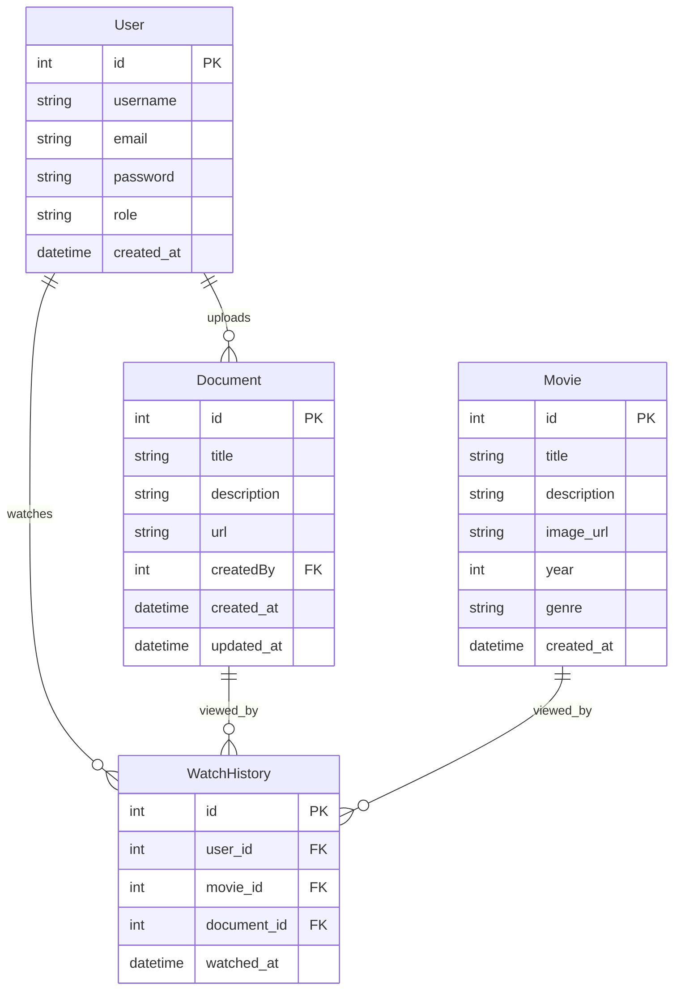

# PDF Viewer Project Structure

## 📁 Project Overview
This is a Next.js PDF viewer application with authentication, file upload, and document management features.

## 🏗️ File Structure Diagram

```mermaid
graph TD
    A[imdb-next/] --> B[📁 src/]
    A --> C[📁 prisma/]
    A --> D[📁 public/]
    A --> E[📄 package.json]
    A --> F[📄 tailwind.config.js]
    A --> G[📄 next.config.mjs]
    
    B --> H[📁 app/]
    B --> I[📁 components/]
    B --> J[📁 contexts/]
    B --> K[📁 lib/]
    
    H --> L[📄 layout.jsx]
    H --> M[📄 page.js]
    H --> N[📄 globals.css]
    H --> O[📄 loading.jsx]
    H --> P[📄 error.jsx]
    H --> Q[📄 Providers.jsx]
    
    H --> R[📁 api/]
    H --> S[📁 about/]
    H --> T[📁 login/]
    H --> U[📁 register/]
    H --> V[📁 profile/]
    H --> W[📁 upload/]
    H --> X[📁 documents/]
    H --> Y[📁 document/]
    
    R --> Z[📁 auth/]
    R --> AA[📁 documents/]
    R --> BB[📁 watch/]
    R --> CC[📁 upload-pdf/]
    
    Z --> DD[📄 login/route.js]
    Z --> EE[📄 register/route.js]
    Z --> FF[📄 me/route.js]
    Z --> GG[📄 session/route.js]
    
    AA --> HH[📄 route.js]
    AA --> II[📁 [id]/]
    II --> JJ[📄 route.js]
    II --> KK[📁 pdf/]
    KK --> LL[📄 route.js]
    
    BB --> MM[📁 add/]
    MM --> NN[📄 route.js]
    
    S --> OO[📄 page.jsx]
    T --> PP[📄 page.jsx]
    U --> QQ[📄 page.jsx]
    V --> RR[📄 page.jsx]
    W --> SS[📄 page.jsx]
    X --> TT[📄 page.jsx]
    Y --> UU[📁 [id]/]
    UU --> VV[📄 page.jsx]
    
    I --> WW[📄 Header.jsx]
    I --> XX[📄 ConditionalLayout.jsx]
    I --> YY[📄 DarkModeSwitch.jsx]
    I --> ZZ[📄 Navbar.jsx]
    I --> AAA[📄 NavbarItem.jsx]
    I --> BBB[📄 MenuItem.jsx]
    
    J --> CCC[📄 AuthContext.js]
    
    K --> DDD[📄 db.js]
    K --> EEE[📄 auth.js]
    
    C --> FFF[📄 schema.prisma]
    C --> GGG[📁 migrations/]
    
    D --> HHH[📄 next.svg]
    D --> III[📄 vercel.svg]
    D --> JJJ[📄 spinner.svg]
    D --> KKK[📄 globe.svg]
    D --> LLL[📄 file.svg]
    D --> MMM[📄 window.svg]
    
    %% Styling
    classDef folder fill:#e1f5fe,stroke:#01579b,stroke-width:2px
    classDef file fill:#f3e5f5,stroke:#4a148c,stroke-width:1px
    classDef api fill:#e8f5e8,stroke:#2e7d32,stroke-width:2px
    classDef page fill:#fff3e0,stroke:#e65100,stroke-width:2px
    classDef component fill:#fce4ec,stroke:#880e4f,stroke-width:2px
    
    class A,B,C,D,H,I,J,K,R,S,T,U,V,W,X,Y,Z,AA,BB,CC,II,KK,MM folder
    class E,F,G,L,M,N,O,P,Q,DD,EE,FF,GG,HH,JJ,LL,NN,OO,PP,QQ,RR,SS,TT,VV,WW,XX,YY,ZZ,AAA,BBB,CCC,DDD,EEE,FFF,GGG,HHH,III,JJJ,KKK,LLL,MMM file
    class DD,EE,FF,GG,HH,JJ,LL,NN api
    class OO,PP,QQ,RR,SS,TT,VV page
    class WW,XX,YY,ZZ,AAA,BBB component
```

## 🛣️ Routing Structure

```mermaid
graph LR
    A[🏠 /] --> B[📄 Home Page]
    A --> C[ℹ️ /about]
    A --> D[🔐 /login]
    A --> E[📝 /register]
    A --> F[👤 /profile]
    A --> G[📤 /upload]
    A --> H[📚 /documents]
    A --> I[📄 /document/[id]]
    
    B --> J[Welcome Page]
    C --> K[About PDF Viewer]
    D --> L[Login Form]
    E --> M[Registration Form]
    F --> N[User Profile]
    G --> O[PDF Upload]
    H --> P[Document List]
    I --> Q[PDF Viewer]
    
    %% API Routes
    R[🔌 /api] --> S[🔐 /api/auth]
    R --> T[📚 /api/documents]
    R --> U[👀 /api/watch]
    R --> V[📤 /api/upload-pdf]
    
    S --> W[POST /api/auth/login]
    S --> X[POST /api/auth/register]
    S --> Y[GET /api/auth/me]
    S --> Z[GET /api/auth/session]
    
    T --> AA[GET /api/documents]
    T --> BB[POST /api/documents]
    T --> CC[GET /api/documents/[id]]
    T --> DD[DELETE /api/documents/[id]]
    T --> EE[GET /api/documents/[id]/pdf]
    
    U --> FF[POST /api/watch/add]
    
    %% Styling
    classDef page fill:#e3f2fd,stroke:#1565c0,stroke-width:2px
    classDef api fill:#e8f5e8,stroke:#2e7d32,stroke-width:2px
    classDef home fill:#fff3e0,stroke:#e65100,stroke-width:3px
    
    class B,C,D,E,F,G,H,I,J,K,L,M,N,O,P,Q page
    class R,S,T,U,V,W,X,Y,Z,AA,BB,CC,DD,EE,FF api
    class B,J home
```

## 🗄️ Database Schema



## 🔧 Key Features

### 📱 **Frontend Pages**
- **Home** (`/`) - Welcome page with features overview
- **About** (`/about`) - Information about the PDF viewer system
- **Login** (`/login`) - User authentication
- **Register** (`/register`) - User registration
- **Profile** (`/profile`) - User profile and statistics
- **Upload** (`/upload`) - PDF file upload (Admin only)
- **Documents** (`/documents`) - List all PDF documents
- **Document Viewer** (`/document/[id]`) - View individual PDF

### 🔌 **API Endpoints**
- **Authentication**: Login, Register, Get current user
- **Documents**: CRUD operations for PDF documents
- **Watch History**: Track document views
- **File Upload**: Proxy to S3 upload server

### 🎨 **Components**
- **Header** - Navigation and dark mode toggle
- **ConditionalLayout** - Conditional rendering based on auth
- **DarkModeSwitch** - Theme toggle functionality
- **Navbar** - Navigation menu items

### 🗄️ **Database**
- **User** - User accounts with roles (ADMIN/USER)
- **Document** - PDF metadata and S3 URLs
- **WatchHistory** - Track user document views
- **Movie** - Legacy movie data (for compatibility)

## 🚀 **Technologies Used**
- **Frontend**: Next.js 15, React, Tailwind CSS
- **Backend**: Next.js API Routes, Prisma ORM
- **Database**: PostgreSQL
- **File Storage**: AWS S3
- **Authentication**: Custom JWT-like tokens
- **PDF Viewing**: Google Docs Viewer, iframe embedding

## 📊 **User Roles**
- **ADMIN**: Can upload, delete PDFs, access all features
- **USER**: Can view PDFs, track viewing history

This structure provides a complete PDF viewing system with user authentication, file management, and responsive design.
